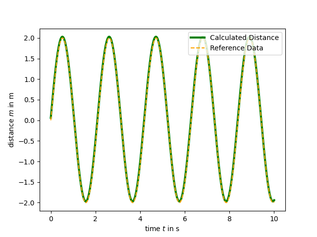

# Demonstrator python projects of Jennifer Weber
- The folder [Simulation](https://github.com/jennyweb/Demonstratoren/tree/main/Simulation) contains an example of a physical simulation in which heat transfer phenomena are modelled. This example describes are stone heating up while sitting in a fire. 


- The folder [divingComputer](https://github.com/jennyweb/Demonstratoren/tree/main/divingComputer) simulates the function of a diving computer. The difficulty in this task was to read in data from an Excel file where the data had irregular shape. The script reads in the data and maps it into dictionaries. These dictionaries are then used to plan a dive as being taught in a diving school. While diving the human body accumulates nitrogen(depending on depths and duration of the dive). The amount of nitrogen is indicated by pressure groups, which are used to determine the maximum time a diver can spend at a certain depth on the second dive. 
 

 - The folder [fitEquationToData](https://github.com/jennyweb/Demonstratoren/tree/main/fitEquationToData) shows how to fit a given equation to given data (data is shown in blue). This fitting has been performed by two means. First, the Nelder-Mead algorithm has been implemented and applied(shown in green). Second, a third-party library (i.e. Scipy; shown in black) has been used as this library contains the very same nelder-mead algorithm so that the results can be compared to validate the functionality of the own algorithm. 
  

- The folder [chemicalReaction](https://github.com/jennyweb/Demonstratoren/tree/main/chemicalReaction) shows an example of a chemical reaction. The following polymerization reaction is taken into account:
 
```math
\begin{align}
\text{M} + \text{M} &\rightarrow \text{P}_2 & \frac {\text{d}[P_2]} {\text{d}t} &= r\, [M][M] \\
\text{M} + \text{P}_2 &\rightarrow \text{P}_3 & \frac {\text{d}[P_3]} {\text{d}t} &= r \,[M][P_2] \\
& \vdots &  & \vdots \\
\text{M} + \text{P}_i & \rightarrow \text{P}_{i+1} & \frac {\text{d}[P_{i+1}]} {\text{d}t} &= r\, [M][P_{i}]
\end{align}
```
The resulting video shows the change of concentration of the polymers (with different chain length $i$) over time.


- The folder [workWithGivenData](https://github.com/jennyweb/Demonstratoren/tree/main/workingWithGivenData) shows an example of how to read in data from a file and perform basic mathematical operations such as computing integrals. The resulting image shows the computed integral next to the analytical solution proving the correctness of my script. 

