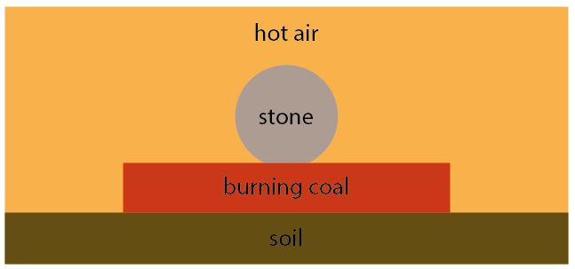
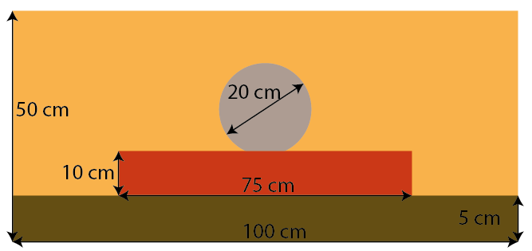
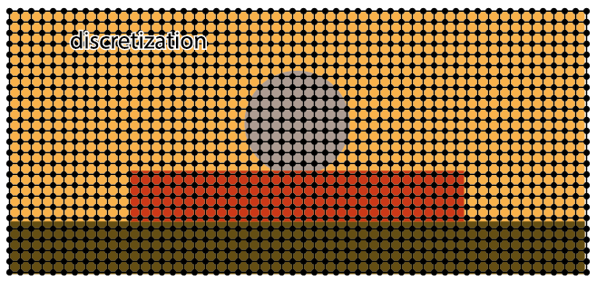
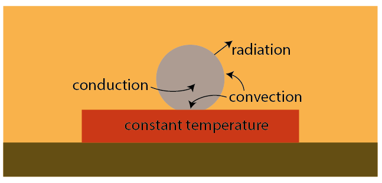
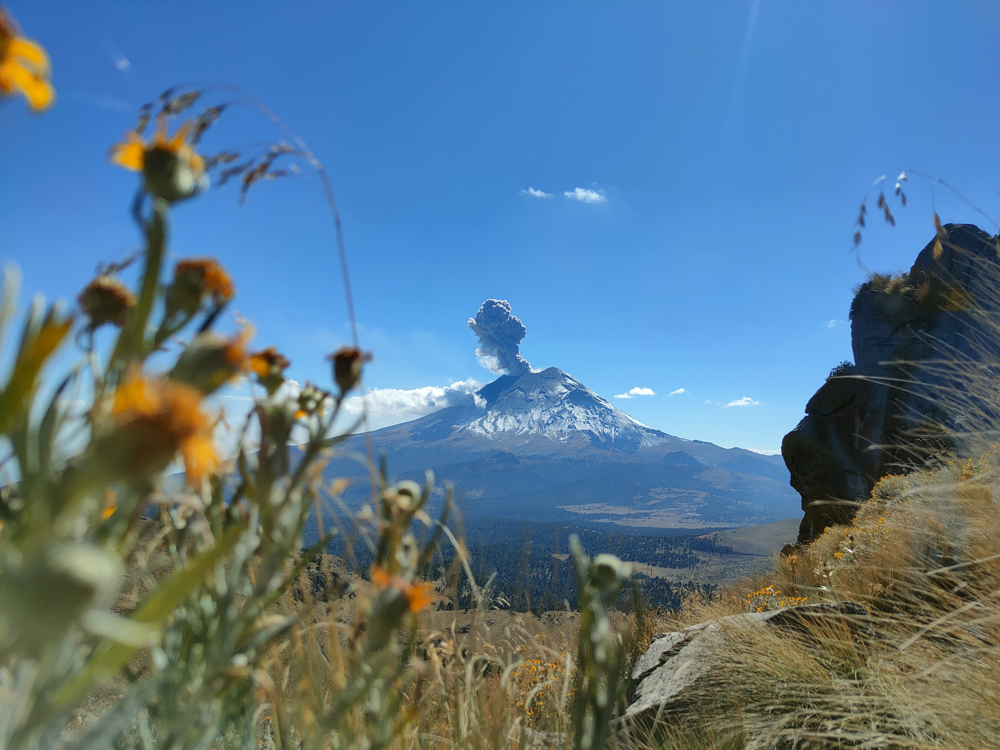

# Physical model for a stone in a campfire

## Motivation

On a recent trip to Mexico my partner and I decided to climb the Iztaccihuatl volcano, which allows great views on the active volcano Popocatépetl. Using public transport it was impossible to get there, climb the volcano and go back on the same day, so we planned to camp there. We found a nice place to set up our tent on 4000 m. We were comfortably sitting around our campfire. When I got up to get something out of the backpack I noticed frost all around us. I was going to be a freezing night! That's when we decided to put a stone in the campfire to keep us warm at night. But how long does it take for the stone to reach a temperature to keep us warm through the night? That's also when the idea for this simulation grew. We had an okay night thanks to the stone and an amazing sunrise behind Popocatépetl. After all it was one of the most memorable excursions in Mexico. If you are interested, have a look at the bottom of this page for some impressions.

## Setup

The situation we are about to model looks as follow:



We have a stone that sits on burning coal in the campfire, the stone is perfectly round. The coal is transferring heat onto the stone which is slowly heating up. The fire is represented by hot air.


I assume the stone diameter to be 20 cm and it sits on a 10 cm high and 75 cm wide patch of coal. The soil thickness is 5 cm. The simulation domains covers an area of 100 cm $\times$ 50 cm.



## Discretization

For this simulation, we apply a finite difference scheme to discretize the continuum. A mesh size of  $\Delta x = 0.002 m$ was chosen. 



## Underlying physical model

This example is a demonstrator of my programming skills and hence focuses on the implementation. Educated guesses were made for the physical variables where necessary. I am aware that the dynamics of the gas phase are neglected.


The underlying model is based on an energy balance, i.e. the enthalpy. The enthalpy is related to temperature via the specific heat capacity $c_p$ and the mass $m$. 

```math
H = c_p \, m \, T
```

The enthalpy change is given by:

```math
\frac{\text{d}H}{\text{d}\text{t}} = \dot{H} \, \text{d}\text{t} \approx \dot{H} \, \Delta t
```

with a time step $\Delta t$.

I consider the following heat transport phenomena: 


- internal heat transport within the stone due to heat conduction
- heat transport across the boundary by heat convection 
- heat loss at the surface due to radiation
- a heat source due to the combustion process is neglected, instead, a constant temperature of the coal at typical combustion temperature is assumed. 

Therefore, $\dot{H}$ is given by
 
```math
\dot{H}  = \dot{H}_\text{radiation} + \dot{H}_\text{convection} + \dot{H}_\text{conduction} 
```

where each constituent is given as follows.

1. First, change in enthalpy at the stone boundary due to radiation $\dot{H}_\text{radiation}$  is given by:

```math
\dot{H}_\text{radiation} = \epsilon \, \sigma \, A \, (T^4 - T_a^4)
```
where $A = \Delta x^2$ is the surface area, $\sigma = 5.670 373 (21) \cdot 10^{−8} \frac{W}{m^2 K^4}$ is the Boltzmann constant, $\sigma = 0.3$ is the emissivity factor and $T_a = 278 K$ is the ambient surrounding temperature. 

2. Second, heat transport at the stone boundary to air and coal due to convection is given by

```math
\dot{H}_\text{convection} = h_\text{stone, other} \, A \, (T - T_\text{other}), \quad \text{other} = \{\text{air}, \text{coal}\} 
```

where $h$ is the heat transfer coefficient and its value is given in the table below. $T_\text{air}$ is chosen as such that it has a temperature of $T=800$ K directly at the surface on the coal and reaches a temperature of $T=1400$ K at the top simulation domain while having a linear temperature profile in between. $T_\text{coal}$ is fixed at $T=1070$ K. 

3. Third, heat conduction is based on Fourier's first law which in 2D is given by:

```math
k \frac{\partial^2 T}{\partial x^2} + k \frac{\partial^2 T}{\partial y^2} = \rho \,  c_p \, \frac{\partial T}{ \partial t}
```

out of which follows. 

```math
\dot{H}_\text{conduction} = m \, k \left(\frac{\partial^2 T}{\partial x^2} + \frac{\partial^2 T}{\partial y^2}\right )
```

where $k = 10 \frac{W}{m K}$ is the heat conductivity, $c_p = 1 \frac{kJ}{kg K}$ is the specific heat capacity and $\rho = 2500 \frac{kg}{m^3}$ is the density of stone. 


The following constants were applied:

| Variable                          | Symbol           | Value                   |Unit                      |  
| :---                              |    :----:        |          ---:           |          ---:            |  
| surrounding air temperature       | $T_\text{air}$   | 278                     | $K$                      | 
| coal temperature       | $T_\text{coal}$   | 1070                     | $K$                      | 
| heat transfer coefficient stone coal        | $h_\text{stone, coal}$              | 1000                       | $\frac{W}{m^2 K}$        |                       
| heat transfer coefficient stone air        | $h_\text{stone, air}$              | 25                       | $\frac{W}{m^2 K}$        |                       
| density stone       | $\rho_\text{stone}$              | 2500                       | $\frac{kg}{m^3}$        |                       
| density coal       | $\rho_\text{coal}$              | 250                       | $\frac{kg}{m^3}$        |                       
| density air       |  $\rho_\text{air}$              | 0.783                       | $\frac{kg}{m^3}$        |                       
| density soil       | $\rho_\text{soil}$              | 920                       | $\frac{kg}{m^3}$        |   | density soil       | $\rho_\text{soil}$              | 920                       | $\frac{kg}{m^3}$        |     


## Result
The following video shows how the stone slowly heats up from the outside.


## Impressions of the hike




