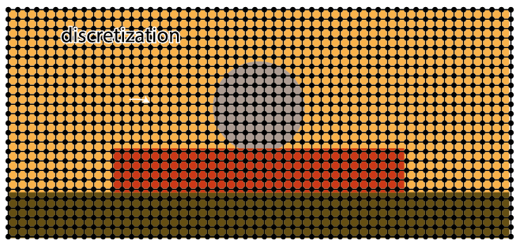

# Physical model for a stone in a campfire

-  On a recent trip to Mexico my partner and I decided to climb the Iztaccihuatl volcano, which allows great views on the active volcano Popocatépetl. Using public transport it was impossible to get there, climb the volcano and go back on the same day, so we planned to camp there. We found a nice place to set up our tent on 4000 m. As we were looking for firewood to men working in a cabin close to our tent offered to gift us some more wood as it would get quite cold at night. We were comfortably sitting around our campfire. When I got up to get something out of the backpack I noticed frost all around us. I was going to be a freezing night! That's when we decided to but a stone in the campfire to keep us warm at night.That's also when the idea for this simulation grew. We had an okay night thanks to the stone and an amazing sunrise behind Popocatépetl. After all it was one of the most memorable excursions in Mexico. If you are interested, have a look at the bottom of this page for some pictures.

- This example is a demonstrator of my programming skills and hence focuses on the implementation. Educated guesses were made for the physical variables where necessary. I am aware that the physical model is incomplete. In particular, the dynamics related to the gas phase are completely neglected. This stimulation only considers heat transfer from

The situation we are about to model looks as follow. We have a stone that sits on burning coal. The coal is transfering heat onto the stone. The stony is heating up. 

Wie groß ist alles. Discretization

Der Stein hat diese Größe. 

## Discretization

- finite difference

- we set a mesh on the continuum. Physical values are available at the mesh nodes. 

We apply a mesh spacing $\Delta x = 0.001 m$

## Underlying physical model

The underlying model is based on an energy balance, i.e. the enthalpy. Enthalpy is strongly related to temperature via the specific heat capacity $c_p$ and the mass $m$. 

$$
H = c_p m T
$$

We apply the following constants

| Variable                          | Symbol           | Value                   |Unit                      |  Comment              |
| :---                              |    :----:        |          ---:           |          ---:            |  ---:                 |
| Boltzmann constant                | $\sigma$         | 5.670 373 (21)×10−8     | $\frac{W}{m^2 K^4}$      | physical constant     |
| emissivity factor                 | $\epsilon$       | 0.3                     | -                        | educated guess        |
| 1-dimensional surface size        | $A$              | 0.005                   | $m$                      | is  mesh spacing $\Delta x$                      |
| ambient surrounding temperature   | $T_a$            | 278                     | $K$                      | educated guess                      |
| surrounding air temperature       | $T_\text{air}$   | 278                     | $K$                      | educated guess                      |
| heat transfer coefficient stone coal        | $h$              | 0.22                       | $\frac{W}{m^2 K}$        |                       |
| heat transfer coefficient stone air        | $h$              | x                       | $\frac{W}{m^2 K}$        |                       |
| heat conductivity coal         | $\lambda$              | 0.3                       | $\frac{W}{m K}$        |                       |
| heat conductivity stone        | $\lambda$              | 10                       | $\frac{W}{m K}$        |                       |

Enthalpie change is given by

$$
\frac{\text{d}H}{\text{d}\text{t}} = \dot{H} \Delta t
$$

where 

$$
\dot{H}  = \dot{H}_\text{radiation} + \dot{H}_\text{convection} + \dot{H}_\text{conduction} + \dot{H}_\text{source}
$$

Each of the elements is described in the following

1. First, change in enthalpy at the stone boundary due to radiation $\dot{H}_\text{radiation}$  is given 

$$
\dot{H}_\text{radiation} = \epsilon \sigma A (T^4 - T_a^4)
$$

2. Heat transport at the stone boundary due to convection is given by 

$$
\dot{H}_\text{convection} = h A (T - T_\text{air})
$$

3. Heat conduction is based on Fourier's first law which in 2D is given by

$$
k \frac{\partial^2 T}{\partial x^2} + k \frac{\partial^2 T}{\partial y^2} = \rho c_p \frac{\partial T}{ \partial t}
$$

hence 
$$
\dot{H}_\text{conduction} = m k \left(\frac{\partial^2 T}{\partial x^2} + \frac{\partial^2 T}{\partial y^2}\right )
$$

## Result

## Impressions of the hike

