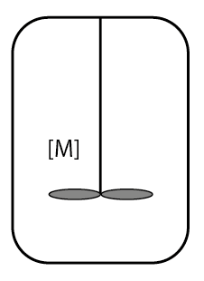

# Model for a polymerization reaction

## Motivation

In this example I consider the case of a polymerization reaction taking place in a perfectly mixed batch reactor. 



## Model of the chemical reaction
The polymers only react with the monomer. Therefore, the chemical reactions are described by the following set of chemical equations

```math
\begin{align}
\text{M} + \text{M} &\rightarrow \text{P}_2 & \frac {\text{d}[P_2]} {\text{d}t} &= r\, [M][M] \\
\text{M} + \text{P}_2 &\rightarrow \text{P}_3 & \frac {\text{d}[P_3]} {\text{d}t} &= r \,[M][P_2] \\
\text{M} + \text{P}_3 &\rightarrow \text{P}_4 & \frac {\text{d}[P_4]} {\text{d}t} &= r\, [M][P_3] \\
\text{M} + \text{P}_i & \rightarrow \text{P}_{i+1} & \frac {\text{d}[P_i]} {\text{d}t} &= r\, [M][P_{i-1}]
\end{align}
```
<<<<<<< HEAD

where $r = 0.01 \frac{L}{mol s}$ is the reaction rate, $[M]$ is the monomer concentration and $[P_i]$ is the concentration of the polymer of chain length $i$. 

$$
\text{M} + \text{P}_3 -> \text{P}_4 \quad \quad\quad \quad\quad \frac {\text{d}[P_4]} {\text{d}t} = r\, [M][P_3]
$$
$$
\text{M} + \text{P}_i -> \text{P}_{i+1} \quad\quad \quad\quad \frac {\text{d}[P_i]} {\text{d}t} = r\, [M][P_{i-1}]
$$

Numerically, the differential equation, of the dimer for example, is solved as
$$
\frac {\text{d}[P_2]} {\text{d}t} = r\, [M][M] \quad \approx \quad \frac {\Delta [P_2]}{\Delta t} = r [M][M]  \quad \leftrightarrow \Delta [P_2] = r\, [M][M]\,\Delta t
$$

with $\Delta t = 0.01$ s. The concentration change for one time increment is given by:
$$
[P_2] (t+1) = [P_2](t)\, + \, r\, [M][M]\,\Delta t
$$
For an arbitrary chain length $i$, I apply
$$
[P_i] (t+1) = [P_i](t)\, + \, r\, [M][P_{i-1}]\,\Delta t
$$

=======
The differential equations can be solved as follows:
```math
\begin{align}
\frac {\text{d}[P_2]} {\text{d}t} = r\, [M][M] & \rightarrow & \Delta [P_2] \, \Delta t = r [M][M]
\end{align}
```
Which can be rearranged to:
```math
\begin{align}
\Delta [P_2] = r\, [M][M]\,\Delta t
\end{align}
```
The concentration change for one time increment is given by:
```math
\begin{align}
[P_2] (t+1) = [P_2](t)\, + \, r\, [M][M]\,\Delta t
\end{align}
```
Analogous for chainlength = i
```math
\begin{align}
[P_i] (t+1) = [P_i](t)\, + \, r\, [M][P_{i-1}]\,\Delta t
\end{align}
```
>>>>>>> 285ea325c1752f1191d04d0e9e3f7d5341de25f7
