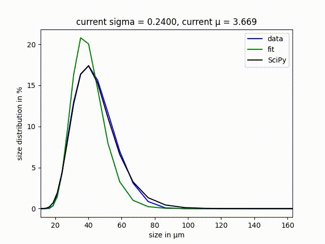

# Data Fitting 

## Motivation
The goal of this project is to fit a given equation to given data. This fitting has been performed by two means. First, the Nelder-Mead algorithm has been implemented and applied. Second, a third-party library (i.e. Scipy) has been used as this library contains the very same nelder-mead algorithm so that the results can be compared to validate the functionality of the own algorithm. 

In this example, I demontrate my capabilities to apply object-oriented programming (OOP) as well as the application of third-party moduls to simplify performing complex tasks.

## Governing equation for fitting

The underlying data set that has been used for this set is a particle size distribution as commonly measured in powder problems. Usually, such a particle size distribution follows a lognormal distribution. A variable $x$ has a log-normal distribution if $\log(x)$ is normally distributed with mean $\mu$ and standard deviation $\sigma$. The probability density function for the log-normal distribution is then given by 

```math
p(x) = \frac{1}{\sigma \, x \, \sqrt{2 \pi}} e^{\left(-\frac{(\ln(x)-\mu)^2}{2 \, \sigma ^2}\right)}
```

## Challenge

The implementation of the Nelder-Mead algorithm requires to apply vector algebra. To simplify coding, I applied object-oriented programming and implemented my own vector class in which I coded the basic vector algebra. 


## Result 

The following video shows the influence of the fitting routine onto the corresponding result. The udnerlying data is the blue curve, i.e. the data that we try to discrebe. The black curve is the solution that is obtained by SciPy and which should be the final result of own 

The video is composed as such that we can follow the alogorithm screening for better candidates of $\sigma$ and $\mu$ to describe the data. After approximately 60 iterations, the algorithm has converged to its final solution of $\sigma$ = 0.2918 and $\mu$ = 3.754 which is also the result of the SciPy module. 


